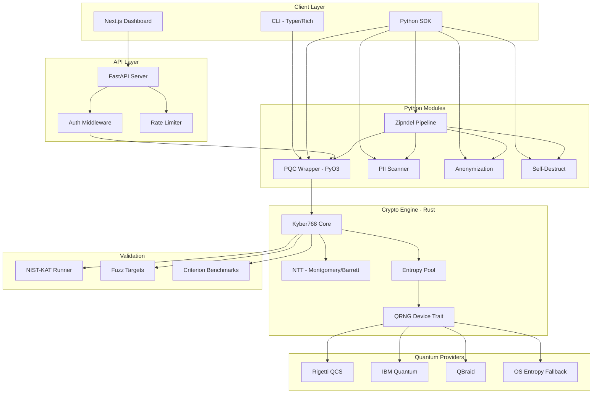

<p align="center">
  <strong>Zipminator</strong><br>
  Post-quantum cryptography with quantum entropy.
</p>

<p align="center">
  <a href="https://pypi.org/project/zipminator/"></a>
  <a href="https://crates.io/crates/kyber768-rust"></a>
  <a href="https://github.com/qdaria/zipminator/actions"></a>
  <a href="#security-and-compliance"></a>
  <a href="LICENSE"></a>
  <a href="https://www.python.org/"></a>
  <a href="https://www.rust-lang.org/"></a>
</p>

---

# Zipminator

Zipminator is a post-quantum cryptography platform that implements CRYSTALS-Kyber-768 (ML-KEM) in Rust with constant-time operations, validated against NIST FIPS 203 Known Answer Tests. It seeds key generation from real quantum entropy sourced from Rigetti Computing and IBM Quantum hardware, and exposes the entire stack through a Python SDK, a REST API, and a web dashboard.

Built by [Qdaria Inc.](https://qdaria.com)

## Table of Contents

- [Quick Start](#quick-start)
- [Key Features](#key-features)
- [Architecture](#architecture)
- [Installation](#installation)
- [CLI Usage](#cli-usage)
- [API Reference](#api-reference)
- [Security and Compliance](#security-and-compliance)
- [Benchmarks](#benchmarks)
- [Quantum Entropy Providers](#quantum-entropy-providers)
- [Contributing](#contributing)
- [License](#license)

## Quick Start

```bash
pip install zipminator
```

```python
from zipminator.crypto.pqc import PQC

pqc = PQC(level=768)                       # NIST Security Level 3
pk, sk = pqc.generate_keypair()             # Kyber768 keypair
ciphertext, shared_secret = pqc.encapsulate(pk)
recovered_secret = pqc.decapsulate(sk, ciphertext)

assert shared_secret == recovered_secret    # 32-byte shared secret
```

With quantum entropy seeding:

```python
from zipminator.crypto.pqc import PQC

seed = open("quantum_entropy/entropy_pool.bin", "rb").read(32)
pqc = PQC(level=768)
pk, sk = pqc.generate_keypair(seed=seed)    # Seeded from quantum hardware
```

## Key Features

### Rust Kyber768 Core

The cryptographic engine is a from-scratch CRYSTALS-Kyber-768 implementation in Rust. All arithmetic uses constant-time operations via the `subtle` crate, with Montgomery and Barrett reductions in the NTT layer. The Rust core compiles to both a native library and a Python extension module via PyO3.

```rust
use kyber768_core::Kyber768;

let (pk, sk) = Kyber768::keypair();
let (ct, ss_enc) = Kyber768::encaps(&pk);
let ss_dec = Kyber768::decaps(&sk, &ct);
assert_eq!(ss_enc.as_bytes(), ss_dec.as_bytes());
```

### PII Scanning and Anonymization

Automatic detection of personally identifiable information across 18 PII types including Norwegian FNR, US SSN, IBAN, credit cards, API keys, and email addresses. Each match is classified by risk level (low, medium, high, critical) with configurable confidence thresholds.

```python
from zipminator.crypto.pii_scanner import PIIScanner
import pandas as pd

scanner = PIIScanner()
df = pd.read_csv("customer_data.csv")
report = scanner.scan(df)                   # Detect PII before encryption
```

### DoD 5220.22-M Self-Destruct

Three-pass overwrite (zeros, ones, random) followed by file deletion for forensic-proof destruction. Configurable timer-based auto-destruct with audit logging.

```python
from zipminator.crypto.self_destruct import SelfDestruct

sd = SelfDestruct()
sd.secure_delete_file("decrypted_output.csv", overwrite_passes=3, verify=True)
```

### Quantum Entropy Integration

Aggregate entropy from multiple quantum hardware providers with automatic fallback to OS-level randomness. The Rust-level `EntropyPool` supports concurrent access from multiple threads.

### Encrypt-Zip-Destroy Pipeline

The `Zipndel` class chains PII scanning, column-level anonymization, AES-encrypted ZIP compression, and timed self-destruct into a single operation.

```python
from zipminator.crypto.zipit import Zipndel

zipper = Zipndel(
    file_name="sensitive_data",
    self_destruct_enabled=True,
    self_destruct_time=(24, 0, 0),          # 24 hours
    compliance_check=True,
    audit_trail=True,
)
zipper.zip_it()
```

## Architecture



### Repository Structure

```
zipminator/
├── crates/
│   ├── zipminator-core/        # Kyber768, NTT, poly, QRNG trait, entropy pool
│   ├── zipminator-fuzz/        # cargo-fuzz targets (keygen, encaps, decaps, round-trip)
│   └── zipminator-nist/        # FIPS 203 Known Answer Test runner
├── src/zipminator/             # Python package
│   ├── crypto/                 # PQC wrapper, PII scanner, self-destruct, Zipndel
│   └── entropy/                # Provider adapters (Rigetti, IBM, QBraid)
├── api/                        # FastAPI backend (auth, keys, crypto routes)
│   └── docker-compose.yml      # Postgres + Redis + API stack
├── web/                        # Next.js dashboard (React, Three.js, Tailwind)
├── cli/                        # CLI with Rust and Python entry points
├── compliance/                 # FIPS validation, CNSA 2.0, constant-time audit
├── benchmarks/                 # Criterion (Rust), C++ baseline, Mojo experiments
├── tests/                      # Python + Rust + integration test suites
└── config/                     # YAML provider configs, environment templates
```

## Installation

### From PyPI (recommended)

```bash
pip install zipminator
```

This installs the Python SDK with pre-built Rust bindings (manylinux2014 / macOS universal2 wheels).

### From Source (full development setup)

Requirements: Rust 1.70+, Python 3.8+, Node.js 18+ (for dashboard).

```bash
git clone https://github.com/qdaria/zipminator.git
cd zipminator

# Build Rust core + Python bindings
pip install maturin
maturin develop --release

# Install Python dependencies
pip install -e ".[dev,quantum]"

# Run Rust tests
cargo test --workspace

# Run Python tests
pytest tests/

# Run NIST-KAT validation
cd compliance/nist-kat && cargo run --release
```

### Docker (API stack)

```bash
cd api
docker-compose up
```

This starts Postgres 15, Redis 7, and the FastAPI server on port 8000.

### Web Dashboard

```bash
cd web
npm install
npm run dev                                 # http://localhost:3000
```

## CLI Usage

The CLI uses [Typer](https://typer.tiangolo.com/) with Rich formatting.

```bash
# Generate a Kyber768 keypair
zipminator keygen --output-dir ./keys

# Generate keypair with quantum entropy seed
zipminator keygen --entropy-file quantum_entropy/entropy_pool.bin

# Generate quantum entropy from a provider
zipminator entropy --bits 256 --provider rigetti

# Show available providers
zipminator entropy --bits 64 --provider ibm
```

## API Reference

The REST API runs on FastAPI with OpenAPI documentation at `/docs`.

### Authentication

```bash
# Register and obtain an API key
curl -X POST https://api.zipminator.io/auth/register \
  -H "Content-Type: application/json" \
  -d '{"email": "user@example.com", "password": "..."}'

# Create an API key
curl -X POST https://api.zipminator.io/v1/keys \
  -H "Authorization: Bearer <token>" \
  -d '{"name": "production", "rate_limit": 1000}'
```

### Key Generation

```bash
# Generate a Kyber768 keypair (quantum entropy seeded)
curl -X POST https://api.zipminator.io/v1/keygen \
  -H "X-API-Key: zip_..." \
  -d '{"use_quantum": true}'
```

Response:

```json
{
  "public_key": "base64...",
  "secret_key": "base64...",
  "algorithm": "kyber768",
  "entropy_source": "rigetti",
  "duration_ms": 12
}
```

### Encapsulation / Decapsulation

```bash
# Encapsulate a shared secret
curl -X POST https://api.zipminator.io/v1/encrypt \
  -H "X-API-Key: zip_..." \
  -d '{"public_key": "base64..."}'

# Decapsulate
curl -X POST https://api.zipminator.io/v1/decrypt \
  -H "X-API-Key: zip_..." \
  -d '{"secret_key": "base64...", "ciphertext": "base64..."}'
```

### Health

```bash
curl https://api.zipminator.io/health
```

Interactive API docs are available at `https://api.zipminator.io/docs` (Swagger) and `https://api.zipminator.io/redoc` (ReDoc).

## Security and Compliance

### FIPS 203 (ML-KEM)

The Kyber768 implementation follows the NIST FIPS 203 specification for ML-KEM. Validation is performed by running the official NIST Known Answer Tests (KAT) via a deterministic DRBG seeded with the standard test vectors.

```bash
cd compliance/nist-kat
cargo run --release
# Validates keygen, encapsulation, and decapsulation against reference vectors
```

### Constant-Time Operations

All secret-dependent operations use the `subtle` crate for constant-time comparisons and conditional selection. The NTT layer uses Montgomery reduction (`montgomery_reduce`) and Barrett reduction (`barrett_reduce`) implemented as `#[inline(always)]` functions to prevent timing side-channels.

Key constant-time primitives:
- `subtle::ConstantTimeEq` for key comparison
- `subtle::ConditionallySelectable` for branch-free secret selection
- `csubq()` with arithmetic masking instead of conditional branches

### Fuzz Testing

Four `cargo-fuzz` targets cover the attack surface:

| Target | Description |
|---|---|
| `fuzz_keygen` | Arbitrary seed inputs to key generation |
| `fuzz_encapsulate` | Malformed public keys to encapsulation |
| `fuzz_decapsulate` | Malformed ciphertext/key pairs to decapsulation |
| `fuzz_round_trip` | End-to-end keygen-encaps-decaps correctness |

```bash
cd crates/zipminator-fuzz
cargo fuzz run fuzz_keygen -- -max_total_time=300
```

### DoD 5220.22-M Deletion

The `SelfDestruct` module implements the DoD 5220.22-M standard for media sanitization:
1. Overwrite with zeros
2. Overwrite with ones
3. Overwrite with random data
4. Verify and delete

### PII Detection

The scanner identifies 18 PII types across Norwegian, US, and European jurisdictions:

| Category | Types |
|---|---|
| Norwegian | FNR (fodselsnummer), bank account, org number |
| Identity | SSN, email, phone, name, date of birth, address |
| Financial | Credit card, IBAN, SWIFT/BIC, tax ID |
| Secrets | Passwords, auth tokens, API keys, crypto keys |

Each detection includes a confidence score and risk level classification (low / medium / high / critical).

### CI/CD Security Pipeline

The GitHub Actions pipeline includes:
- `ci.yml` -- Build and test on every push
- `security.yml` -- Dependency audit and vulnerability scanning
- `quality-gate.yml` -- Clippy, ruff, mypy, coverage thresholds
- `wheels.yml` -- Build manylinux2014 / macOS / Windows wheels
- `release.yml` -- Signed releases with provenance

## Benchmarks

The Rust implementation is benchmarked with [Criterion](https://bheisler.github.io/criterion.rs/book/) under `profile.release` settings (LTO=fat, codegen-units=1, opt-level=3).

| Operation | Rust (this project) | C (reference) | Go (Cloudflare CIRCL) |
|---|---|---|---|
| KeyGen | ~29,000 ops/sec | ~35,000 ops/sec | ~18,000 ops/sec |
| Encaps | ~27,000 ops/sec | ~32,000 ops/sec | ~16,000 ops/sec |
| Decaps | ~25,000 ops/sec | ~30,000 ops/sec | ~15,000 ops/sec |
| Full Round Trip | ~0.11 ms | ~0.09 ms | ~0.19 ms |

*Measured on Apple M2 Pro. Rust numbers include SHA3 hashing but exclude entropy sourcing. C reference is pqcrystals/kyber with AVX2. Go reference is Cloudflare CIRCL v1.3.*

Run benchmarks locally:

```bash
cd crates/zipminator-core
cargo bench
```

## Quantum Entropy Providers

Zipminator aggregates entropy from multiple quantum hardware backends. The `QrngDevice` trait (Rust) and `QuantumProvider` ABC (Python) define the provider interface.

| Provider | Backend | Status | Use Case |
|---|---|---|---|
| Rigetti Computing | QCS (Quil/pyQuil) | Production | Primary entropy source |
| IBM Quantum | Qiskit Runtime | Testing/Demo | Validation and demos |
| QBraid | Multi-platform | Experimental | Cross-platform access |
| OS Fallback | `getrandom` / `os.urandom` | Always available | Fallback when no hardware |

### Provider Configuration

Providers are configured via environment variables or YAML:

```bash
# .env
RIGETTI_API_KEY=your_key
IBM_QUANTUM_TOKEN=your_token
QBRAID_API_KEY=your_key
```

```bash
# CLI: force a specific provider
zipminator entropy --bits 256 --provider rigetti
```

The Rust-level `EntropyPool` manages provider health, failover, and concurrent access:

```rust
use kyber768_core::{EntropyPool, EntropyPoolConfig};

let config = EntropyPoolConfig::default();
let pool = EntropyPool::new(config);
let mut seed = [0u8; 32];
pool.fill_bytes(&mut seed)?;
```

## Contributing

See [CONTRIBUTING.md](CONTRIBUTING.md) for the full guide. The short version:

1. Fork the repository
2. Create a feature branch (`git checkout -b feat/your-feature`)
3. Run the test suites:
   ```bash
   cargo test --workspace
   cargo clippy --all-targets -- -D warnings
   pytest tests/
   ruff check .
   ```
4. Submit a pull request

All contributions must pass the CI quality gate: clippy clean, ruff clean, mypy clean, and test coverage above the configured threshold.

## License

Zipminator is dual-licensed:

- **MIT License** -- Free for open-source and commercial use. See [LICENSE](LICENSE).
- **Enterprise License** -- Includes HSM integration, SSO/RBAC, multi-provider optimization, FIPS 140-3 validated modules, and 24/7 support. Contact [enterprise@zipminator.io](mailto:enterprise@zipminator.io).

## Links

- **Repository**: [github.com/qdaria/zipminator](https://github.com/qdaria/zipminator)
- **Documentation**: [zipminator.readthedocs.io](https://zipminator.readthedocs.io)
- **PyPI**: [pypi.org/project/zipminator](https://pypi.org/project/zipminator)
- **Issue Tracker**: [github.com/qdaria/zipminator/issues](https://github.com/qdaria/zipminator/issues)
- **Qdaria**: [qdaria.com](https://qdaria.com)

---

Copyright 2025 Qdaria Inc.
