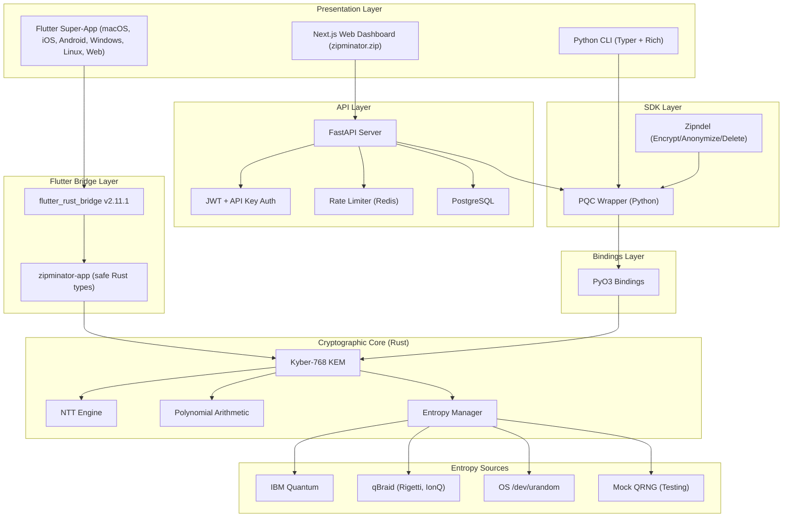
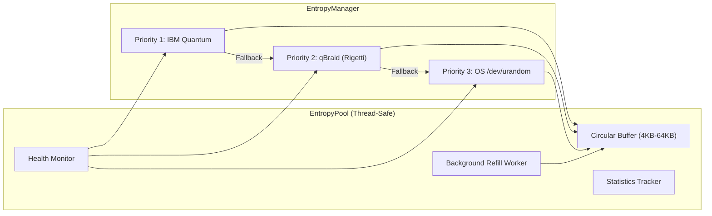
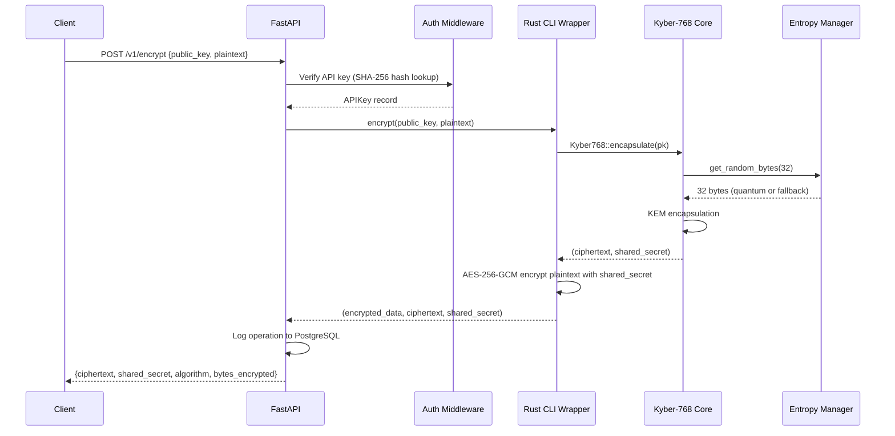
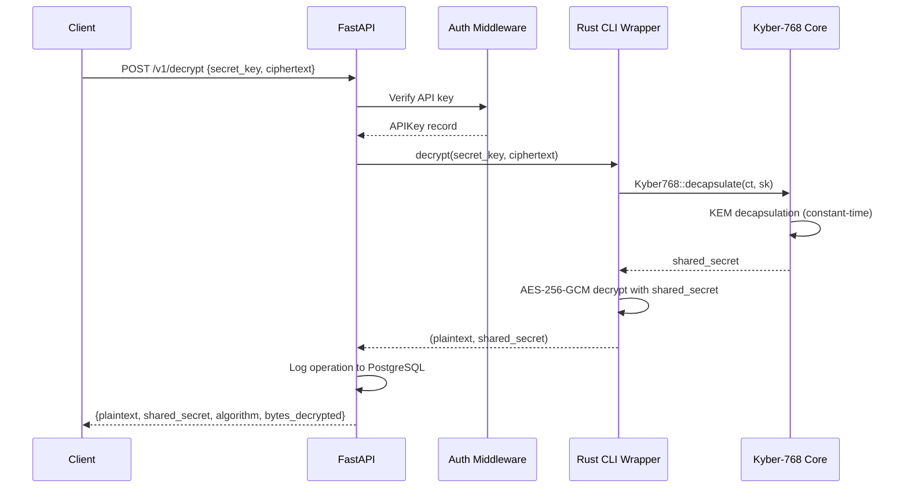

# Architecture Guide

This document describes the internal architecture of Zipminator, from the low-level cryptographic core to the user-facing web interface.

---

## System Overview

Zipminator is structured as a layered system with clear separation between the cryptographic core, language bindings, SDK, API, and presentation layers. The Flutter super-app provides a single codebase for all 6 platforms via `flutter_rust_bridge`.



---

## Cryptographic Core (`crates/zipminator-core`)

The core is written entirely in Rust for memory safety, performance, and constant-time guarantees. It implements CRYSTALS-Kyber-768 as specified in NIST FIPS 203 (ML-KEM).

### Module Structure

```
crates/zipminator-core/src/
    lib.rs                  # Public API, module re-exports
    constants.rs            # Kyber-768 parameters (n=256, k=3, q=3329)
    kyber768.rs             # KeyGen, Encaps, Decaps
    ntt.rs                  # Number Theoretic Transform
    poly.rs                 # Polynomial and PolyVec operations
    utils.rs                # SHA3, SHAKE, randomness helpers
    entropy_source.rs       # Multi-source entropy manager
    errors.rs               # Error types
    python_bindings.rs      # PyO3 wrappers
    qrng/
        mod.rs              # QrngDevice trait, HealthStatus, QrngError
        entropy_pool.rs     # Thread-safe buffered entropy pool
        ibm_quantum.rs      # IBM Quantum backend
        id_quantique.rs     # ID Quantique hardware device
        mock.rs             # Deterministic mock for testing
```

### Kyber-768 Parameters

| Parameter | Value | Description |
|---|---|---|
| n | 256 | Polynomial degree |
| k | 3 | Module dimension (Kyber-768) |
| q | 3329 | Modulus (prime) |
| eta1 | 2 | Noise parameter for secret/error vectors |
| eta2 | 2 | Noise parameter for encryption |
| Public key size | 1184 bytes | `k * 384 + 32` |
| Secret key size | 2400 bytes | Includes embedded public key and hash |
| Ciphertext size | 1280 bytes | `k * 384 + 128` |
| Shared secret | 32 bytes | SHA3-256 output |

### Kyber-768 Implementation Details

#### Key Generation

1. Sample a 32-byte seed from the entropy source.
2. Expand the seed via SHA3-512 into a public seed and a noise seed.
3. Generate the public matrix **A** from the public seed using SHAKE-128 (XOF).
4. Sample the secret vector **s** and error vector **e** using centered binomial distribution (CBD) with eta=2.
5. Transform **s** and **e** into the NTT domain.
6. Compute **t = A * s + e** in the NTT domain.
7. Pack the public key as `(t || publicseed)` and the secret key as `(s || pk || H(pk) || seed)`.

#### Encapsulation

1. Sample random 32-byte message **m** (coins).
2. Derive **(K, r) = G(m || H(pk))** via SHA3-512 per FIPS 203.
3. Sample vectors **r**, **e1**, **e2** from the randomness **r**.
4. Compute **u = A^T * r + e1** and **v = t^T * r + e2 + Encode(m)**.
5. Compress and pack ciphertext.
6. Derive the final shared secret: **K_bar = H(K || H(c))**.

#### Decapsulation

1. Decompress the ciphertext to recover **u** and **v**.
2. Compute **m' = Decode(v - s^T * u)**.
3. Re-encapsulate with **m'** to produce **c'**.
4. Constant-time comparison of **c** and **c'**.
5. If match: shared secret = **H(K' || H(c))**.
6. If mismatch: implicit rejection with **H(z || H(c))** where **z** is stored in the secret key.

All branching on secret data uses the `subtle` crate for constant-time operations via `ConstantTimeEq` and `ConditionallySelectable`.

### Number Theoretic Transform (NTT)

The NTT is the performance-critical component, accounting for approximately 30% of total execution time. The implementation uses:

- **In-place Cooley-Tukey butterfly operations** for the forward NTT.
- **Gentleman-Sande butterfly** for the inverse NTT.
- **Montgomery reduction** for modular multiplication: computes `a * R^(-1) mod q` where `R = 2^16`.
- **Barrett reduction** for general modular reduction.
- **Constant-time conditional subtraction** (`csubq`) to normalize coefficients into `[0, q-1]`.

The NTT uses precomputed twiddle factors (zetas) stored in `constants.rs`, derived from the primitive 512th root of unity modulo 3329.

Pointwise multiplication in the NTT domain is performed via `basemul_ntt`, which processes coefficients in pairs using the Karatsuba-like technique from the Kyber specification.

### Polynomial Arithmetic (`poly.rs`)

- `Poly`: A single polynomial with 256 coefficients in `Z_q`.
- `PolyVec`: A vector of `k=3` polynomials.
- Operations: `ntt()`, `invntt()`, `add()`, `reduce()`, `compress()`, `decompress()`, `cbd()` (centered binomial distribution), `pointwise_acc()` (inner product in NTT domain).

---

## Entropy Pool Architecture

The entropy system uses a priority-based multi-provider architecture with automatic fallback.



### EntropyPool

The `EntropyPool` struct provides thread-safe buffering of quantum random data with background refilling:

| Config Parameter | Default | Description |
|---|---|---|
| `min_bytes` | 4,096 | Minimum bytes to maintain |
| `max_bytes` | 65,536 | Maximum buffer capacity |
| `refill_chunk_size` | 8,192 | Size of each background refill |
| `refill_threshold` | 16,384 | Trigger refill when below this level |
| `health_check_interval` | 60s | Periodic device health verification |

The pool uses a `crossbeam` bounded channel for refill requests and a dedicated background thread that handles both refilling and periodic health checks. When a consumer calls `get_random_bytes()`, the pool checks if the buffer is below the refill threshold and asynchronously requests more entropy from the QRNG device.

### EntropyManager

The `EntropyManager` maintains an ordered list of `EntropySource` implementations. On each request, it tries the highest-priority source first and falls back to lower-priority sources if the primary fails. Source transitions are logged as warnings.

### Provider Implementations

| Provider | Source | Latency | Notes |
|---|---|---|---|
| IBM Quantum | Quantum circuit measurement | ~seconds | Uses `qiskit` via pre-harvested pool files |
| qBraid | Multi-provider (Rigetti, IonQ) | ~seconds | Unified API, requires API key |
| ID Quantique | Hardware QRNG (USB) | ~microseconds | Requires physical device |
| OS urandom | Kernel CSPRNG | ~nanoseconds | Always available, non-quantum fallback |
| Mock | Deterministic counter | instant | Testing only |

---

## Data Flow

### Encrypt Path



### Decrypt Path



---

## Security Model

### Threat Model

Zipminator is designed to protect data confidentiality against the following adversaries:

| Threat | Mitigation |
|---|---|
| Quantum computer (Shor's algorithm) | CRYSTALS-Kyber-768 (NIST Level 3, lattice-based) |
| Timing side-channels | Constant-time operations via `subtle` crate, Montgomery/Barrett reduction |
| Memory disclosure | Rust ownership model prevents use-after-free, buffer overflows |
| Harvest-now-decrypt-later | Post-quantum KEM ensures forward secrecy against future quantum adversaries |
| Key compromise | Implicit rejection on decapsulation failure (prevents adaptive chosen-ciphertext attacks) |
| Weak randomness | Multi-provider quantum entropy with OS urandom fallback |
| API abuse | JWT + API key authentication, per-key rate limiting, operation audit logging |

### Constant-Time Guarantees

The following operations are implemented in constant time:

- Ciphertext comparison during decapsulation (`ct_eq` from `subtle`).
- Shared secret selection between valid and rejection paths (`ConditionallySelectable`).
- Montgomery reduction and Barrett reduction (arithmetic-only, no branches).
- Conditional subtraction of q (`csubq`, uses arithmetic masking).

### Key Sizes and Security Levels

| Algorithm | NIST Level | Classical Security | Quantum Security |
|---|---|---|---|
| Kyber-512 | 1 | AES-128 equivalent | ~100 bits |
| Kyber-768 (default) | 3 | AES-192 equivalent | ~160 bits |
| Kyber-1024 | 5 | AES-256 equivalent | ~230 bits |

---

## Performance Characteristics

Target performance on modern x86_64 hardware (single core):

| Operation | Target Latency | Notes |
|---|---|---|
| KeyGen | < 0.03 ms | NTT-dominated |
| Encapsulation | < 0.04 ms | Matrix-vector multiply + NTT |
| Decapsulation | < 0.04 ms | Includes re-encapsulation for CCA check |
| Full round-trip | < 0.1 ms | KeyGen + Encaps + Decaps |
| NTT (forward) | ~10 us | 7 butterfly layers, 256 coefficients |
| Entropy pool read | < 1 us | When buffer is pre-filled |

The Rust implementation targets performance parity with the C/AVX2 reference at approximately 0.034ms for a full Kyber-768 operation.

---

## PyO3 Bindings Layer

The Python bindings expose five functions and three classes:

### Functions

| Function | Signature | Description |
|---|---|---|
| `keypair()` | `() -> (PublicKey, SecretKey)` | Generate random keypair |
| `keypair_from_seed(seed)` | `(bytes) -> (PublicKey, SecretKey)` | Deterministic keypair from 32-byte seed |
| `encapsulate(pk)` | `(PublicKey) -> (Ciphertext, bytes)` | KEM encapsulation |
| `encapsulate_with_coins(pk, coins)` | `(PublicKey, bytes) -> (Ciphertext, bytes)` | Deterministic encapsulation |
| `decapsulate(ct, sk)` | `(Ciphertext, SecretKey) -> bytes` | KEM decapsulation |
| `get_constants()` | `() -> dict` | Returns Kyber-768 size constants |

### Classes

| Class | Properties | Methods |
|---|---|---|
| `PublicKey` | `size` (1184) | `from_bytes(data)`, `to_bytes()` |
| `SecretKey` | `size` (2400) | `from_bytes(data)`, `to_bytes()` |
| `Ciphertext` | `size` (1280) | `from_bytes(data)`, `to_bytes()` |

### Python SDK Wrapper (`src/zipminator/crypto/pqc.py`)

The `PQC` class provides a unified interface that automatically selects the best available backend:

1. **Rust backend** (via PyO3) -- preferred, high performance.
2. **Pure Python fallback** (via `kyber-py`) -- no compilation required, slower.

The wrapper supports all three Kyber security levels (512, 768, 1024), though the Rust backend currently implements only Kyber-768.

---

## Web Frontend (`web/`)

The web frontend is a Next.js 16 application with Tailwind CSS (custom `quantum-*` tokens), Framer Motion, and next-auth v5 beta.

**Production:** [zipminator.zip](https://zipminator.zip) (Vercel)

### Routes

| Route | Purpose |
|-------|---------|
| `/` | Landing page (Hero, SS7 threat, 8 modules, tech stack, stats, use cases, CTA) |
| `/features` | Feature showcase |
| `/demo` | Interactive demo |
| `/dashboard` | 9-tab dashboard (requires auth) |
| `/impact` | Environmental and social impact |
| `/invest` | 21-slide investor pitch deck (public) |
| `/auth/login` | OAuth sign-in (GitHub, Google, LinkedIn) |

### Key Components

- **Hero** -- Product landing with animated quantum particles
- **SS7ThreatSection** -- 4 attack vectors blocked by Zipminator
- **ModulesSection** -- 8 super-app modules with icons and descriptions
- **EncryptionStackSection** -- 16 security technologies explained
- **StatsSection** -- Animated counters (870K+ LOC, 156 qubits, etc.)
- **CompetitorSection** -- Signal vs ProtonMail vs NordVPN comparison
- **21 Pitch Slides** -- TitleSlide through ContactSlide with scenario toggles
- **WaitlistForm** -- Supabase-backed with Zod validation and rate limiting

### Design System

- Fonts: Inter (body), JetBrains Mono (code), Outfit (headings)
- Colors: `quantum-300` to `quantum-700` gradient palette
- Classes: `btn-primary`, `card-quantum`, `gradient-text`, `container-custom`

The dashboard communicates with the FastAPI backend for cryptographic operations. Auth is handled by next-auth v5 beta with PKCE S256.

## ZipBrowser (`browser/`)

A Tauri 2.x PQC-enabled desktop browser with:

- PQC TLS proxy (ML-KEM-768 key exchange detection)
- Built-in Q-VPN (PQ-WireGuard tunnel with kill switch)
- Q-AI Assistant sidebar (summarization, writing assist, chat)
- PQC password vault (Argon2 master key, ML-KEM encrypted entries)
- Cookie rotation and fingerprint resistance
- Zero telemetry architecture
- Tab management, address bar, navigation controls

## Flutter Super-App (`app/`)

The Flutter super-app replaces the scattered Expo (mobile), Tauri (desktop), and Next.js (web) apps with a single codebase targeting all 6 platforms. It uses `flutter_rust_bridge` (FRB) v2.11.1 for type-safe Dart-Rust interop.

### Architecture

```
Flutter UI (Dart)
    ↓ Riverpod 3 Notifiers (state management)
    ↓ Auto-generated Dart bindings (app/lib/src/rust/api/simple.dart)
    ↓ flutter_rust_bridge v2.11.1 (app/rust/)
    ↓ zipminator-app crate (safe Rust types, session store)
    ↓ zipminator-core crate (ML-KEM-768, NTT, ratchet, SRTP)
```

### Bridge Layer (`crates/zipminator-app/`)

Platform-agnostic bridge crate that wraps `zipminator-core` with safe types for FRB:

- `crypto.rs` — `keypair()`, `encapsulate(pk)`, `decapsulate(ct, sk)`, `composite_keypair()`
- `ratchet.rs` — Session-store pattern via `LazyLock<Mutex<HashMap<u64, PqRatchetSession>>>`. Flutter references sessions by opaque `u64` IDs.
- `email.rs` — `encrypt_email()`, `decrypt_email()` wrapping `EmailCrypto`
- `pii.rs` — `scan_text()`, `scan_text_json()` with JSON output for Dart parsing
- `srtp.rs` — `derive_srtp_keys()` from Kyber shared secrets via HKDF-SHA-256

### FRB Functions (16 total)

| Function | Type | Description |
|----------|------|-------------|
| `init_app()` | `#[frb(init)]` | FRB initialization |
| `version()` | `#[frb(sync)]` | Bridge version string |
| `keypair()` | async | ML-KEM-768 key generation (PK: 1184B, SK: 2400B) |
| `encapsulate(pk)` | async | KEM encapsulation (CT: 1088B, SS: 32B) |
| `decapsulate(ct, sk)` | async | KEM decapsulation (SS: 32B) |
| `composite_keypair()` | async | Composite KEM keypair (PK: 1216B, SK: 2432B) |
| `ratchet_init_alice()` | async | Start ratchet session as initiator |
| `ratchet_init_bob(pk)` | async | Join ratchet session as responder |
| `ratchet_alice_finish(...)` | async | Complete handshake |
| `ratchet_encrypt(id, pt)` | async | Encrypt message in session |
| `ratchet_decrypt(id, hdr, ct)` | async | Decrypt message in session |
| `ratchet_destroy(id)` | `#[frb(sync)]` | Destroy session |
| `derive_srtp_keys(ss)` | async | PQ-SRTP key derivation |
| `pii_scan(text, codes)` | `#[frb(sync)]` | PII detection (returns JSON) |
| `email_encrypt(pk, pt, aad)` | async | PQC email encryption |
| `email_decrypt(sk, env, aad)` | async | PQC email decryption |

### State Management (Riverpod 3)

7 Notifier providers managing all pillar state:

| Provider | State | Pillar |
|----------|-------|--------|
| `cryptoProvider` | `KeypairState` | Vault |
| `ratchetProvider` | `RatchetState` + `ChatMessage[]` | Messenger |
| `voipProvider` | `VoipState` (SRTP keys, call status) | VoIP |
| `vpnProvider` | `VpnState` (status, kill switch, traffic) | VPN |
| `piiProvider` | `PiiScanState` + `PiiMatch[]` | Anonymizer |
| `emailCryptoProvider` | `EmailCryptoState` | Email |
| `themeModeProvider` | `ThemeMode` | Settings |

### Design System (Quantum Theme)

Material 3 with custom tokens:
- **Colors**: quantumCyan(#00E5FF), quantumBlue(#2979FF), quantumPurple(#7C4DFF), quantumGreen(#00E676)
- **Surfaces**: surfaceDark(#0A0A1A), surfaceCard(#111128), surfaceElevated(#1A1A3E)
- **Fonts**: Outfit (headings), Inter (body), JetBrains Mono (labels/code)
- **Modes**: Dark-first with light mode toggle

---

## Mobile App (`mobile/`)

An Expo React Native app with:

- PQC Messenger (Double Ratchet, SignalingService)
- VoIP (WebRTC + PQ-SRTP)
- Q-VPN toggle
- Key generator
- PII scanner
- 11 test suites, 267+ tests passing

---

## Additional Modules

### Compliance (`compliance/`)

NIST KAT (Known Answer Test) validation against FIPS 203 test vectors. The `zipminator-nist` crate provides deterministic RNG injection for reproducible test vector generation.

### Benchmarks (`benchmarks/`, `crates/zipminator-bench`)

Criterion-based Rust benchmarks for NTT, polynomial arithmetic, and full KEM operations. Python benchmarks compare Rust-accelerated vs. pure-Python performance.

### Fuzzing (`crates/zipminator-fuzz`)

Cargo-fuzz targets for:

- `fuzz_round_trip` -- KeyGen + Encaps + Decaps round-trip correctness
- `fuzz_keygen` -- Key generation with arbitrary seeds
- `fuzz_encapsulate` -- Encapsulation with arbitrary public keys
- `fuzz_decapsulate` -- Decapsulation with arbitrary ciphertext/key pairs
